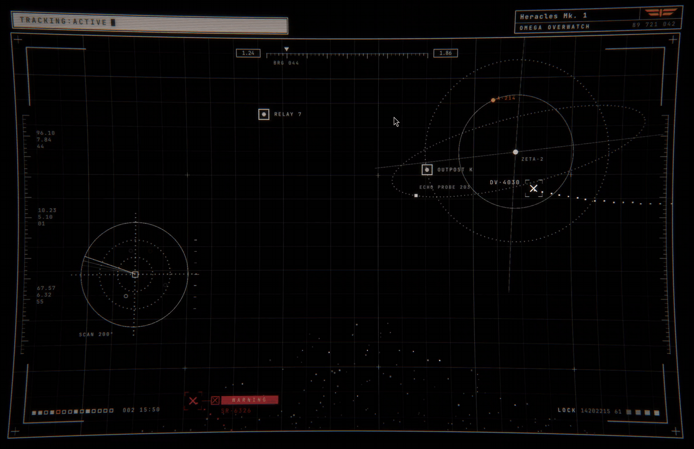

# Afterglow

A live, theme-aware cassette-futurist interface wallpaper for the Omarchy desktop. Inspired by the tactile user interfaces seen in nostalgic sci-fi media. Install, customize, and reminisce on the digital future we were promised but traded for emotionless rounded corners. 



## The future we were promised

Before screens were sheets of glass, the future was drawn in phosphor. The
crew of the *Nostromo* in *Alien* read their fate off flickering monitors and
green text. In *Blade Runner*, Deckard's Esper machine inches into a
photograph one grudging, whirring step at a time. In *Andor*, the Empire
tracks rebels across chunky, clattering consoles you could picture repairing
with a screwdriver. They were props, but they promised a certain kind of
future: machines that felt *built*, where every readout had a job and every
switch had travel.

That future never quite arrived. Our interfaces became flat, frictionless and
endlessly scrollable. They're better in nearly every way we can measure, and
colder in a way that's harder to.

Afterglow brings a little of that other future to your desktop. It keeps the
CRT's imperfections on purpose: the bend of the glass, the lines of the
raster, light bleeding softly around anything bright, colour fringing at the
edges. None of it is a flaw to correct. It's the warmth, proof that the light
came from somewhere. The name is the phenomenon itself: the glow a phosphor
keeps giving off after the beam has moved on.

## What it does

Spacecraft cross a plotting grid, leaving dotted trails that hold and then
fade before the next heading comes in. Around them sits an instrument HUD:
an orbital plot, a radar scope with a stepped sweep, live RAM and GPU meters,
station markers, a debris point cloud, tick rulers, telemetry readouts, and callouts that flag the
occasional contact with a blinking `WARNING` or a `TARGET LOCK`. The whole
thing is bent through a CRT shader with curvature, scanlines, phosphor glow
and edge fringing.

It **follows your Omarchy theme.** Every colour comes from the active
theme's palette and updates live when you run `omarchy theme set`. It works
on dark and light themes alike.

## Install

```sh
omarchy plugin add https://github.com/SwiizerKuh/omarchy-afterglow.git --enable
```

It appears on every monitor straight away.

### Setup

`omarchy plugin add` never runs code from a plugin, so the setup comes a
moment later instead. The first time the plugin loads, a short setup opens
in a floating terminal, styled to your theme:


1. **Customize Afterglow?** Choose *Not now* to keep the defaults.
2. **CRT effects:** on (curvature, scanlines, phosphor glow) or off.
3. **Visuals:** *Full*, or *Minimal* without the radar scope.
4. **Save?** Nothing is written until you confirm.

Your answers are merged into `~/.config/omarchy/afterglow.json`. Only
the keys it asked about (`crt.enabled`, `hud.scope`) are set; anything else
in the file is kept. The setup is offered once, and never if you already have
a config file. Run it again any time:

```sh
omarchy-shell io.github.swiizerkuh.afterglow setup
```

## Remove

```sh
omarchy plugin remove io.github.swiizerkuh.afterglow
```

The plugin only writes to your configuration when you choose *Save* in the
setup. To remove every trace, also delete `~/.config/omarchy/afterglow.json`
(if you saved settings) and `~/.local/state/afterglow/` (a one-line
marker recording that the setup was offered).

## How it sits on your desktop

Afterglow does **not** replace Omarchy's background plugin. It draws on
its own layer between your wallpaper and your windows:

- your wallpaper, wallpaper cycling, transitions and the desktop's
  double-click menus keep working as before;
- the layer is click-through, so it never takes input;
- removing or disabling the plugin leaves your desktop exactly as it was.

By default a soft wash of your theme's background colour (`backdrop`) sits
behind the plot, so it stays legible over busy photo wallpapers. Set it to
`0` on a dark, plain wallpaper for the purest look.

## Requirements

- Omarchy with the Quattro shell (the Quickshell-based `omarchy-shell`).
- `gum` and `jq` for the setup. Both ship with Omarchy.
- Nothing else. No system services and no elevated privileges; the meters run
  one small helper script (`bin/sysmon`) for the length of the session. The
  CRT shader ships precompiled as `crt.frag.qsb`, with its source in
  `crt.frag`.

## Configure

Settings are JSON, layered, with later layers overriding earlier ones key
by key:

| Layer | File | Who it's for |
|---|---|---|
| 1 | `defaults.json` in this plugin | the reference for every key |
| 2 | `afterglow.json` in the **active theme** | theme authors |
| 3 | `~/.config/omarchy/afterglow.json` | you |

You only need to include the keys you want to change. Your file and the
theme's file are watched, so edits apply straight away.

```json
{
  "backdrop": 0.35,
  "paths": 4,
  "crt": { "curvature": 0.03, "scanlineAlpha": 0.15 },
  "hud": {
    "scope": false,
    "text": { "tracking": "UPLINK:NOMINAL", "identTitle": "Pathfinder Mk. 2" }
  }
}
```

### Colours

Colour settings take either a **theme role** or a literal `"#rrggbb"`.
Roles keep the plot in step with whatever theme is active:

| Role | Comes from `colors.toml` | Used for |
|---|---|---|
| `foreground` | `foreground` | grid, HUD lines, text, most trails |
| `accent` | `accent` | attention: `TARGET LOCK`, lamps, the logo |
| `urgent` | `red` | fault: `WARNING` |
| `muted` | `muted` | available for your own palette |
| `background` | `background` | the backdrop, text on filled bars |

Keys: `gridColor`, `colors` (the trail palette, e.g.
`["foreground", "foreground", "accent"]`; repeat an entry to weight it),
`crt.halationTint`, `hud.warningColor`, `hud.targetColor`.

On light themes the phosphor glow switches off, because glow reads as a
smudge on a light ground. Set `crt.halationOnLight` to `true` to keep it.

### Main keys

| Key | Default | Meaning |
|---|---|---|
| `enabled` | `true` | Turn the whole plot off without removing the plugin. |
| `backdrop` | `0.55` | Opacity of the theme-background wash over your wallpaper. |
| `paths` | `3` | Concurrent trajectories (max 8). |
| `tickMs` | `100` | Clock step. Motion is deliberately stepped (see below). |
| `cell`, `gridMajorEvery`, `gridAlpha`, `gridMajorAlpha` | | The grid. |
| `raster`, `dotSize`, `dotSpacing` | | Trail dots and the pixel grid they snap to. |
| `crossMin/Max`, `holdMin/Max`, `fadeMin/Max`, `gapMin/Max` | | Trajectory timing in ms. |

### `crt`

| Key | Default | Meaning |
|---|---|---|
| `enabled` | `true` | The whole CRT treatment. |
| `curvature` | `0.042` | Barrel strength, 0–0.4. |
| `scanlines`, `scanlinePitch`, `scanlineAlpha` | on, 3, 0.22 | Scanlines, which bend with the tube. |
| `mask`, `maskAlpha` | off | Vertical shadow mask. |
| `halation`, `halationStrength`, `halationRadius`, `halationTint`, `halationColorize` | on | Phosphor glow. |
| `vignette`, `vignetteAlpha`, `vignetteSpread` | on | Edge falloff. |
| `aberration` | `0.8` | R/B fringing at the edges, in px. |
| `supersample` | `1.5` | Render scale before the warp, which keeps 1px lines crisp. |

### `hud`

Every element can be switched on or off: `frame`, `rulers`, `scale`,
`headers`, `telemetry`, `status`, `orbit`, `scope`, `stations`, `cloud`,
`callouts`, `identLogo`. Also available:

| Key | Default | Meaning |
|---|---|---|
| `alpha` | `0.34` | Brightness of the HUD line work. |
| `inset`, `topInset`, `bandTop` | 22, 94, 38 | Frame and header-band placement. |
| `clipToFrame` | `true` | Keep the grid, trails and instruments inside the frame. |
| `orbitX/Y/Radius`, `scopeX/Y/Radius` | | Instrument placement (fractions of the screen). |
| `cloudCount/X/Spread/Height` | | The debris field. |
| `warningChance`, `targetChance` | 0.12, 0.14 | Odds that a trajectory gets a callout. |
| `text.tracking`, `text.identTitle`, `text.identName`, `text.identCode` | | Header text. |

`defaults.json` lists every key with its default.

### System meters

Two live meters sit at the top left of the frame: **memory allocation** and
**graphics processor load**. Each is a heavy-outlined bar with a hatched fill,
the percentage beside it, and a readout underneath (memory used and total, or
the GPU driver and device).

The fill is a row of blocks. When a reading changes, the leading block fades
from transparent to opaque before the next one starts, so the bar crawls to
its new value. Once it settles, the last block re-fills on every new sample.
Above `sysmonWarnAt` a meter switches to the theme's `urgent` colour.

Readings come from `bin/sysmon`, a small bash script started once per session
(not once per monitor). It only reads `/proc` and `/sys`, writes nothing, and
uses about 1% of one CPU core at the default 2-second interval.

- **RAM:** `MemTotal` and `MemAvailable` from `/proc/meminfo`.
- **GPU:** the first source that works:
  - `gpu_busy_percent` in sysfs (AMD);
  - the kernel's per-client GPU accounting in `/proc/<pid>/fdinfo`, the same
    data `nvtop` uses (Intel, AMD and other open drivers). It needs no
    privileges, so it counts your own user's processes, which on a desktop
    means the compositor and every app;
  - `nvidia-smi`, for the proprietary NVIDIA driver.

  With none of these available, the meter reads `--%` and `NO GPU TELEMETRY`.
  Verified on Intel Iris Xe (i915) against the GPU's own RC6 idle counters.
  The AMD and NVIDIA paths follow those drivers' documented interfaces but
  have not been tested on that hardware.

| Key | Default | Meaning |
|---|---|---|
| `hud.sysmon` | `true` | Show the meters and run the sampler. |
| `hud.sysmonInterval` | `2000` | Sample interval in ms (minimum 500). |
| `hud.sysmonWarnAt` | `90` | Percentage at which a meter turns `urgent`. |
| `hud.text.ramLabel`, `hud.text.gpuLabel` | | Meter labels. |


## For theme authors

Ship a `afterglow.json` in your theme directory to style the plot for
your theme. It is picked up when your theme is applied and dropped when the
user switches away. See [`examples/cassette-futurism.json`](examples/cassette-futurism.json)
for a complete example: a black-and-white theme with orange and burgundy
accents, and no backdrop.

## Performance

Measured on a 2256×1504 laptop panel (Intel, Omarchy Quattro), as CPU of the
shell process with the plugin enabled versus disabled:

| Configuration | Shell CPU |
|---|---|
| Plugin disabled | ~1% |
| Defaults | ~10% of one core |
| `"tickMs": 200` | ~6% |
| Battery saver (below) | ~4% |

Nearly all of the cost is the clock rate: each step re-renders the plot and
runs the CRT pass. For a laptop on battery:

```json
{ "tickMs": 250, "paths": 2, "crt": { "halation": false, "supersample": 1.0 } }
```

Motion is stepped on purpose. One shared clock drives everything, so the
scene sits idle between steps instead of redrawing at 60fps, and discrete
jumps suit a radar plot better than smooth motion. Static artwork (grid,
frame, rings, point cloud) is drawn once and reused, and the CRT pass runs on
the GPU.

## Updating

```sh
omarchy plugin update io.github.swiizerkuh.afterglow
omarchy restart shell
```

Service plugins are not re-created on hot reload, so restart the shell after
an update. Config file changes do not need a restart.

## Editing the shader

```sh
/usr/lib/qt6/bin/qsb --glsl "100 es,120,150" --hlsl 50 --msl 12 -o crt.frag.qsb crt.frag
omarchy restart shell
```

`qsb` is in the `qt6-shadertools` package. You only need it to change the
shader, not to run the plugin.

## License

MIT. See [LICENSE](LICENSE).
